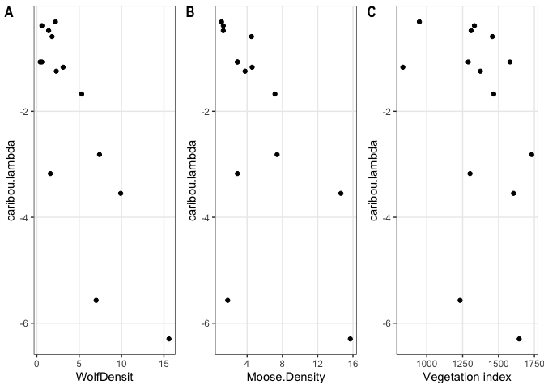

Caribou Path Analysis–Add reviewer suggested paths for appendix
================
Clayton T. Lamb
26 October, 2020

\#\#Load Data, Functions and Cleanup Data

``` r
##packages
library(here)
library(lavaan)
library(semPlot)
require(cowplot)
library(corrplot)
library(ggraph)
library(igraph)
library(QuantPsyc)
library(ggpubr)
library(MuMIn)
library(knitr)
library(piecewiseSEM)
library(tidyverse)

##data
df <- read.csv(here::here("data", "final.csv"))

##transform to instantaneous rate of growth (r)
df$caribou.lambda <- log(df$lambda)

##set seed for any bootstrapping
set.seed(2019)
```

\#\#Plot raw data

``` r
a <-ggplot(df, aes(x=disturb.p, y=dEVI))+
  geom_point()+
  theme_bw()+
  theme(panel.grid.minor = element_blank())

b <-ggplot(df, aes(x=dEVI, y=Moose.Density))+
  geom_point()+
  theme_bw()+
  theme(panel.grid.minor = element_blank())+
  xlab("Vegetation index")+
  ylab(expression(Moose~(ind./100~km^2)))

c <-ggplot(df, aes(x=Moose.Density, y=WolfDensit))+
  geom_point()+
  theme_bw()+
  theme(panel.grid.minor = element_blank())+
  xlab(expression(Moose~(ind./100~km^2)))+
  ylab(expression(Wolf~(ind./1000~km^2)))

d <-ggplot(df, aes(x=WolfDensit, y=caribou.lambda))+
  geom_point()+
  theme_bw()+
  theme(panel.grid.minor = element_blank())+
  #geom_vline(xintercept=6.5)+
  geom_hline(yintercept=0, linetype="dashed")+
  xlab(expression(Wolf~(ind./1000~km^2)))+
  ylab("Caribou inst. pop. growth (r)")

e <-ggplot(df, aes(x=WolfDensit, y=lambda))+
  geom_point()+
  theme_bw()+
  theme(panel.grid.minor = element_blank())+
  #geom_vline(xintercept=6.5)+
  geom_hline(yintercept=1, linetype="dashed")+
  xlab(expression(Wolf~(ind./1000~km^2)))+
  ylab("Caribou pop. growth")


ggarrange(a,b,c,d,nrow=2,ncol=2, labels ="AUTO")
```

<!-- -->

``` r
#ggsave(here::here("plots","univar.png"), width=7, height=2.5, units="in")
ggarrange(b,c,e,nrow=1,ncol=3, labels ="AUTO")
```

<!-- -->

``` r
#ggsave(here::here("plots","univar2.png"), width=7, height=2.5, units="in")


f <- ggplot(df, aes(x=WolfDensit, y=survival))+
  geom_point()+
  theme_bw()+
  theme(panel.grid.minor = element_blank())+
  xlab(expression(wolf~(n/1000~km^2)))

g <- ggplot(df, aes(x=WolfDensit, y=reproduction))+
  geom_point()+
  theme_bw()+
  theme(panel.grid.minor = element_blank())+
  xlab(expression(wolf~(n/1000~km^2)))


ggarrange(f,g,
          ncol = 2, nrow = 1,
          labels="AUTO")
```

<!-- -->

``` r
#ggsave(here::here("plots","vitalrate_wolf.png"), width=6, height=2.7, units="in")
```

\#\#transformations to linear

``` r
###transform caribou lambda
df$caribou.lambda <--(exp(-10*df$caribou.lambda))

##make sure the rest remain linear 
a <- ggplot(df, aes(x=WolfDensit, y=caribou.lambda))+
  geom_point()+
  theme_bw()+
  theme(panel.grid.minor = element_blank())

b <- ggplot(df, aes(x=Moose.Density, y=caribou.lambda))+
  geom_point()+
  theme_bw()+
  theme(panel.grid.minor = element_blank())

c <- ggplot(df, aes(x=dEVI, y=caribou.lambda))+
  geom_point()+
    xlab("Vegetation index")+
  theme_bw()+
  theme(panel.grid.minor = element_blank())

ggarrange(a,b,c,
          ncol = 3, nrow = 1,
          labels="AUTO")
```

<!-- -->

``` r
###transform dEVI
df$dEVI <-exp(0.005*df$dEVI)

##make sure the rest remain linear
d <- ggplot(df, aes(y=Moose.Density, x=dEVI))+
  geom_point()+
    xlab("Vegetation index")+
  theme_bw()+
  theme(panel.grid.minor = element_blank())

e <- ggplot(df, aes(y=WolfDensit, x=dEVI))+
  geom_point()+
    xlab("Vegetation index")+
  theme_bw()+
  theme(panel.grid.minor = element_blank())

f <- ggplot(df, aes(y=caribou.lambda, x=dEVI))+
  geom_point()+
    xlab("Vegetation index")+
  theme_bw()+
  theme(panel.grid.minor = element_blank())

ggarrange(d,e,f,
          ncol = 3, nrow = 1,
          labels="AUTO")
```

<!-- -->

\#\#D-Separation analysis

``` r
##lay out models
##green=dEVI which is a greeness (food) index
##ha= habitat alteration, which is what we call disturb.p here as well
mA <- "green>moose>wolf, ha>caribou"
mB <- "green>moose>wolf>caribou, ha>wolf"
mC <- "ha>green>moose>wolf, green>caribou, moose>caribou"
mD <- "ha>green>moose>wolf>caribou"
mE <- "green>moose>wolf>caribou, ha>caribou"
mF <- "ha>green>moose>wolf, green>caribou"

modelA <- psem(lm(Moose.Density ~ dEVI, df),
               lm(WolfDensit ~ Moose.Density, df),
               lm(caribou.lambda ~ disturb.p, df))

modelB <- psem(lm(Moose.Density ~ dEVI, df),
               lm(WolfDensit ~ Moose.Density + disturb.p, df),
               lm(caribou.lambda ~ WolfDensit, df))

modelC <- psem(lm(Moose.Density ~ dEVI, df),
               lm(WolfDensit ~ Moose.Density, df),
               lm(caribou.lambda ~ Moose.Density+dEVI, df),
               lm(dEVI~disturb.p, df))

modelD <- psem(lm(Moose.Density ~ dEVI, df),
               lm(WolfDensit ~ Moose.Density, df),
               lm(caribou.lambda ~ WolfDensit, df),
               lm(dEVI~disturb.p, df))

modelE <- psem(lm(Moose.Density ~ dEVI, df),
               lm(WolfDensit ~ Moose.Density, df),
               lm(caribou.lambda ~ WolfDensit +disturb.p, df))

modelF <- psem(lm(Moose.Density ~ dEVI, df),
               lm(WolfDensit ~ Moose.Density, df),
               lm(caribou.lambda ~ dEVI, df),
               lm(dEVI~disturb.p, df))


##summarize
data.frame(model=c("A","B","C","D","E","F"),
                      description=c(mA,mB,mC,mD,mE,mF),
                      p=round(c(summary(modelA, .progressBar = F)$Cstat$P.Value,
                           summary(modelB, .progressBar = F)$Cstat$P.Value,
                           summary(modelC, .progressBar = F)$Cstat$P.Value,
                           summary(modelD, .progressBar = F)$Cstat$P.Value,
                           summary(modelE, .progressBar = F)$Cstat$P.Value,
                           summary(modelF, .progressBar = F)$Cstat$P.Value
                           ),3),
                      K=c(summary(modelA, .progressBar = F)$IC$K,
                           summary(modelB, .progressBar = F)$IC$K,
                           summary(modelC, .progressBar = F)$IC$K,
                           summary(modelD, .progressBar = F)$IC$K,
                           summary(modelE, .progressBar = F)$IC$K,
                           summary(modelF, .progressBar = F)$IC$K
                           ),
                      AICc=round(c(summary(modelA, .progressBar = F)$IC$AICc,
                           summary(modelB, .progressBar = F)$IC$AICc,
                           summary(modelC, .progressBar = F)$IC$AICc,
                           summary(modelD, .progressBar = F)$IC$AICc,
                           summary(modelE, .progressBar = F)$IC$AICc,
                           summary(modelF, .progressBar = F)$IC$AICc
                           ),2))%>%
  mutate(dAICc=AICc-min(AICc))%>%
  arrange(dAICc)%>%
  as_tibble()%>%
  kable()
```

| model | description                                            |     p |  K |   AICc |  dAICc |
| :---- | :----------------------------------------------------- | ----: | -: | -----: | -----: |
| B     | green\>moose\>wolf\>caribou, ha\>wolf                  | 0.433 | 10 | 140.42 |   0.00 |
| A     | green\>moose\>wolf, ha\>caribou                        | 0.036 |  9 | 140.59 |   0.17 |
| E     | green\>moose\>wolf\>caribou, ha\>caribou               | 0.429 | 10 | 140.61 |   0.19 |
| D     | ha\>green\>moose\>wolf\>caribou                        | 0.558 | 12 | 485.32 | 344.90 |
| F     | ha\>green\>moose\>wolf, green\>caribou                 | 0.012 | 12 | 694.78 | 554.36 |
| C     | ha\>green\>moose\>wolf, green\>caribou, moose\>caribou | 0.044 | 13 |    Inf |    Inf |

``` r
###Is there another path (F), that was excluded but was maybe statistically important?
#lm(caribou.lambda~ disturb.p + WolfDensit, data=df)%>%summary() 
##no, wolf density remains significantly negative (p=0.0006), disturb.p has no effect (p=0.58)


##final model selection table with p<0.05 removed
aic.tab <- data.frame(model=c("A","B","C","D","E","F"),
                      description=c(mA,mB,mC,mD,mE,mF),
                      p=round(c(summary(modelA, .progressBar = F)$Cstat$P.Value,
                           summary(modelB, .progressBar = F)$Cstat$P.Value,
                           summary(modelC, .progressBar = F)$Cstat$P.Value,
                           summary(modelD, .progressBar = F)$Cstat$P.Value,
                           summary(modelE, .progressBar = F)$Cstat$P.Value,
                           summary(modelF, .progressBar = F)$Cstat$P.Value
                           ),3),
                      K=c(summary(modelA, .progressBar = F)$IC$K,
                           summary(modelB, .progressBar = F)$IC$K,
                           summary(modelC, .progressBar = F)$IC$K,
                           summary(modelD, .progressBar = F)$IC$K,
                           summary(modelE, .progressBar = F)$IC$K,
                           summary(modelF, .progressBar = F)$IC$K
                           ),
                      AICc=round(c(summary(modelA, .progressBar = F)$IC$AICc,
                           summary(modelB, .progressBar = F)$IC$AICc,
                           summary(modelC, .progressBar = F)$IC$AICc,
                           summary(modelD, .progressBar = F)$IC$AICc,
                           summary(modelE, .progressBar = F)$IC$AICc,
                           summary(modelF, .progressBar = F)$IC$AICc
                           ),2))%>%
  filter(p>0.05)%>%
  mutate(dAICc=AICc-min(AICc))%>%
  arrange(dAICc)%>%
  as_tibble()

aic.tab%>%
  write_csv(here::here("tables","aicc.csv"))

aic.tab%>%
  kable()
```

| model | description                              |     p |  K |   AICc |  dAICc |
| :---- | :--------------------------------------- | ----: | -: | -----: | -----: |
| B     | green\>moose\>wolf\>caribou, ha\>wolf    | 0.433 | 10 | 140.42 |   0.00 |
| E     | green\>moose\>wolf\>caribou, ha\>caribou | 0.429 | 10 | 140.61 |   0.19 |
| D     | ha\>green\>moose\>wolf\>caribou          | 0.558 | 12 | 485.32 | 344.90 |

\#calc AICc by hand

``` r
##calc by hand
###there's an issue here, where K is approaching n, AIC goes to INF.

###A
m <-summary(modelA, .progressBar = F)
C <- m$Cstat$Fisher.C
K <- m$IC$K
n <- m$IC$n

(C+ ((2*K)))*(n/(n-K-1))
```

    ## [1] 140.5915

``` r
##works OK n=14, K=9
n 
```

    ## [1] 14

``` r
K
```

    ## [1] 9

``` r
(n/(n-K-1))
```

    ## [1] 3.5

``` r
###D 
m <-summary(modelD, .progressBar = F)
C <- m$Cstat$Fisher.C
K <- m$IC$K
n <- m$IC$n

(C+ ((2*K)))*(n/(n-K-1))
```

    ## [1] 485.324

``` r
##approaching over paramaterized, n=14, k=12, hit to AICc is huge.
n 
```

    ## [1] 14

``` r
K
```

    ## [1] 12

``` r
(n/(n-K-1))
```

    ## [1] 14

``` r
###C
m <-summary(modelC, .progressBar = F)
C <- m$Cstat$Fisher.C
K <- m$IC$K
n <- m$IC$n

(C+ ((2*K)))*(n/(n-K-1))
```

    ## [1] Inf

``` r
n/(n-K-1) ##doesn't work, n=14, k=13
```

    ## [1] Inf
