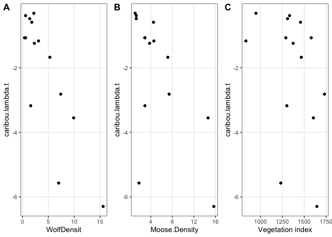

Caribou Path Analysis
================
Clayton T. Lamb
07 October, 2020

\#\#Load Data, Functions and Cleanup Data

``` r
##packages
library(here)
library(lavaan)
library(semPlot)
require(cowplot)
library(corrplot)
library(ggraph)
library(igraph)
library(QuantPsyc)
library(ggpubr)
library(MuMIn)
library(knitr)
library(piecewiseSEM)
library(tidyverse)

##data
df <- read.csv(here::here("data", "final.csv"))%>%
  filter(Name!="Tweedsmuir")%>% ##remove Tweedsmuir- non-boreal
  rename(dVI=LAI)

##transform to instantaneous rate of growth (r)
df$caribou.lambda <- log(df$lambda)

##set seed for any bootstrapping
set.seed(2019)
```

\#\#Plot raw data

``` r
a <-ggplot(df, aes(x=disturb.p, y=dVI))+
  geom_point()+
  theme_bw()

b <-ggplot(df, aes(x=dVI, y=Moose.Density))+
  geom_point()+
  theme_bw()+
  xlab("Vegetation index")+
  ylab(expression(Moose~(ind./100~km^2)))

c <-ggplot(df, aes(x=Moose.Density, y=WolfDensit))+
  geom_point()+
  theme_bw()+
  xlab(expression(Moose~(ind./100~km^2)))+
  ylab(expression(Wolf~(ind./1000~km^2)))

d <-ggplot(df, aes(x=WolfDensit, y=caribou.lambda))+
  geom_point()+
  theme_bw()+
  #geom_vline(xintercept=6.5)+
  geom_hline(yintercept=0, linetype="dashed")+
  xlab(expression(Wolf~(ind./1000~km^2)))+
  ylab("Caribou pop. growth (r)")

e <-ggplot(df, aes(x=WolfDensit, y=lambda))+
  geom_point()+
  theme_bw()+
  #geom_vline(xintercept=6.5)+
  geom_hline(yintercept=1, linetype="dashed")+
  xlab(expression(Wolf~(ind./1000~km^2)))+
  ylab("Caribou pop. growth")


ggarrange(a,b,c,d,nrow=2,ncol=2, labels ="AUTO")
```

<!-- -->

``` r
ggsave(here::here("plots","univar.png"), width=7, height=5, units="in")
ggarrange(b,c,e,nrow=1,ncol=3, labels ="AUTO")
```

<!-- -->

``` r
ggsave(here::here("plots","univar2.png"), width=7, height=2.5, units="in")


f <- ggplot(df, aes(x=WolfDensit, y=survival))+
  geom_point()+
  theme_bw()+
  xlab(expression(wolf~(n/1000~km^2)))

g <- ggplot(df, aes(x=WolfDensit, y=reproduction))+
  geom_point()+
  theme_bw()+
  xlab(expression(wolf~(n/1000~km^2)))


ggarrange(f,g,
          ncol = 2, nrow = 1,
          labels="AUTO")
```

<!-- -->

``` r
ggsave(here::here("plots","vitalrate_wolf.png"), width=6, height=2.7, units="in")
```

\#\#Find intersections

``` r
###Wolf-Caribou lambda<0 intersection
predict(lm(WolfDensit~caribou.lambda+I(caribou.lambda^2)+I(caribou.lambda^3), data=df), newdata=data.frame(caribou.lambda=0))
```

    ##        1 
    ## 1.800993

``` r
##plot
df$predicted <- predict(lm(WolfDensit~caribou.lambda+I(caribou.lambda^2)+I(caribou.lambda^3), data=df), newdata=df)
ggplot(df)+
  geom_point(aes(x=WolfDensit, y=caribou.lambda))+
  geom_line(aes(y=caribou.lambda, x=predicted))+
  theme_bw()+
  geom_vline(xintercept=1.8, linetype="dashed", col="red")+
  xlab(expression(wolf~(n/1000~km^2)))+
  ylab("caribou pop. growth (r)")
```

<!-- -->

``` r
##population declines when > 1.8 wolves/1000 sq.km


##Moose-Wolf intersection

##1.9 wolves/1000 sq.km generally reached when moose are greater than 2.9/100 sq.km
predict(lm(Moose.Density~WolfDensit+I(WolfDensit^2), data=df), newdata=data.frame(WolfDensit=1.9))
```

    ##        1 
    ## 2.918599

``` r
##plot
df$predicted.moose <- predict(lm(Moose.Density~WolfDensit+I(WolfDensit^2), data=df), newdata=df)
ggplot(df)+
  geom_point(aes(y=WolfDensit, x=Moose.Density))+
  geom_line(aes(y=WolfDensit, x=predicted.moose))+
    geom_vline(xintercept=2.9, linetype="dashed", col="red")+
  theme_bw()+
  xlab(expression(moose~(n/100~km^2)))+
  ylab(expression(wolf~(n/1000~km^2)))
```

<!-- -->

``` r
#bootstrap errors
int.data <- data.frame()
for(i in 1:1000){
df.i <- df%>%sample_frac(1, replace=TRUE)

a <- data.frame(i=i,
                type=c("wolf", "moose"),
                val=c(predict(lm(WolfDensit~caribou.lambda+I(caribou.lambda^2)+I(caribou.lambda^3), data=df.i), newdata=data.frame(caribou.lambda=0)),
                      predict(lm(Moose.Density~WolfDensit+I(WolfDensit^2), data=df.i), newdata=data.frame(WolfDensit=1.9))))
              
int.data <- rbind(int.data,a)
}

int.data%>%
  group_by(type)%>%
  summarize(median=median(val)%>%round(2),
            upper=quantile(val,0.95)%>%round(2),
            lower=quantile(val,0.05)%>%round(2))%>%
  print()
```

\#\#transformations to linear

``` r
###transform caribou lambda
df$caribou.lambda <--(exp(-10*df$caribou.lambda))

##make sure the rest remain linear 
a <- ggplot(df, aes(x=WolfDensit, y=caribou.lambda))+
  geom_point()+
  theme_bw()

b <- ggplot(df, aes(x=Moose.Density, y=caribou.lambda))+
  geom_point()+
  theme_bw()

c <- ggplot(df, aes(x=dVI, y=caribou.lambda))+
  geom_point()+
    xlab("Vegetation index")+
  theme_bw()

ggarrange(a,b,c,
          ncol = 3, nrow = 1,
          labels="AUTO")
```

<!-- -->

``` r
###transform dVI
df$dVI <-exp(0.005*df$dVI)

##make sure the rest remain linear
d <- ggplot(df, aes(y=Moose.Density, x=dVI))+
  geom_point()+
    xlab("Vegetation index")+
  theme_bw()

e <- ggplot(df, aes(y=WolfDensit, x=dVI))+
  geom_point()+
    xlab("Vegetation index")+
  theme_bw()

f <- ggplot(df, aes(y=caribou.lambda, x=dVI))+
  geom_point()+
    xlab("Vegetation index")+
  theme_bw()

ggarrange(d,e,f,
          ncol = 3, nrow = 1,
          labels="AUTO")
```

<!-- -->

\#\#Correlation marix

``` r
M <- cor(df%>%
           dplyr::select(disturb.p,dVI, Moose.Density, WolfDensit,caribou.lambda)%>%
           rename(`Habitat alteration`=disturb.p,
                  `Vegetation index`=dVI,
                  `Moose density`=Moose.Density,
                  `Wolf density`=WolfDensit,
                  `Caribou pop. growth`=caribou.lambda), use="complete.obs")

corrplot(M, method = "number", type = "upper", order = "hclust")
```

<!-- -->

\#\#D-Separation analysis

``` r
##lay out models
mA <- "green>moose>wolf, ha>caribou"
mB <- "green>moose>wolf>caribou, ha>wolf"
mC <- "green>moose>wolf, green>caribou, moose>caribou, ha"
mD <- "green>moose>wolf>caribou, ha"
mE <- "green>moose>wolf>caribou, ha>caribou"
mF <- "green>moose>wolf, green>caribou, ha"

modelA <- psem(lm(Moose.Density ~ dVI, df),
               lm(WolfDensit ~ Moose.Density, df),
               lm(caribou.lambda ~ disturb.p, df))

modelB <- psem(lm(Moose.Density ~ dVI, df),
               lm(WolfDensit ~ Moose.Density + disturb.p, df),
               lm(caribou.lambda ~ WolfDensit, df))

modelC <- psem(lm(Moose.Density ~ dVI, df),
               lm(WolfDensit ~ Moose.Density, df),
               lm(caribou.lambda ~ Moose.Density+dVI, df))%>%
  update(disturb.p ~ 1)

modelD <- psem(lm(Moose.Density ~ dVI, df),
               lm(WolfDensit ~ Moose.Density, df),
               lm(caribou.lambda ~ WolfDensit, df))%>%
  update(disturb.p ~ 1)

modelE <- psem(lm(Moose.Density ~ dVI, df),
               lm(WolfDensit ~ Moose.Density, df),
               lm(caribou.lambda ~ WolfDensit +disturb.p, df))

modelF <- psem(lm(Moose.Density ~ dVI, df),
               lm(WolfDensit ~ Moose.Density, df),
               lm(caribou.lambda ~ dVI, df))%>%
  update(disturb.p ~ 1)


##summarize
data.frame(model=c("A","B","C","D","E","F"),
                      description=c(mA,mB,mC,mD,mE,mF),
                      p=round(c(summary(modelA, .progressBar = F)$Cstat$P.Value,
                           summary(modelB, .progressBar = F)$Cstat$P.Value,
                           summary(modelC, .progressBar = F)$Cstat$P.Value,
                           summary(modelD, .progressBar = F)$Cstat$P.Value,
                           summary(modelE, .progressBar = F)$Cstat$P.Value,
                           summary(modelF, .progressBar = F)$Cstat$P.Value
                           ),3),
                      K=c(summary(modelA, .progressBar = F)$IC$K,
                           summary(modelB, .progressBar = F)$IC$K,
                           summary(modelC, .progressBar = F)$IC$K,
                           summary(modelD, .progressBar = F)$IC$K,
                           summary(modelE, .progressBar = F)$IC$K,
                           summary(modelF, .progressBar = F)$IC$K
                           ),
                      AICc=round(c(summary(modelA, .progressBar = F)$IC$AICc,
                           summary(modelB, .progressBar = F)$IC$AICc,
                           summary(modelC, .progressBar = F)$IC$AICc,
                           summary(modelD, .progressBar = F)$IC$AICc,
                           summary(modelE, .progressBar = F)$IC$AICc,
                           summary(modelF, .progressBar = F)$IC$AICc
                           ),2))%>%
  mutate(dAICc=AICc-min(AICc))%>%
  arrange(dAICc)%>%
  as_tibble()%>%
  kable()
```

| model | description                                            |     p |  K |   AICc | dAICc |
| :---- | :----------------------------------------------------- | ----: | -: | -----: | ----: |
| D     | green\>moose\>wolf\>caribou, ha                        | 0.519 |  9 | 101.89 |  0.00 |
| B     | green\>moose\>wolf\>caribou, ha\>wolf                  | 0.453 | 10 | 139.32 | 37.43 |
| E     | green\>moose\>wolf\>caribou, ha\>caribou               | 0.444 | 10 | 139.80 | 37.91 |
| A     | green\>moose\>wolf, ha\>caribou                        | 0.034 |  9 | 141.05 | 39.16 |
| F     | green\>moose\>wolf, green\>caribou, ha                 | 0.015 |  9 | 150.46 | 48.57 |
| C     | green\>moose\>wolf, green\>caribou, moose\>caribou, ha | 0.043 | 10 | 180.93 | 79.04 |

``` r
###Is there another path (F), that was excluded but was maybe statistically important?
#lm(caribou.lambda~ disturb.p + WolfDensit, data=df)%>%summary() 
##no, wolf density remains significantly negative (p=0.0006), disturb.p has no effect (p=0.58)

##final model selection table with p<0.05 removed
aic.tab <- data.frame(model=c("A","B","C","D","E","F"),
                      description=c(mA,mB,mC,mD,mE,mF),
                      p=round(c(summary(modelA, .progressBar = F)$Cstat$P.Value,
                           summary(modelB, .progressBar = F)$Cstat$P.Value,
                           summary(modelC, .progressBar = F)$Cstat$P.Value,
                           summary(modelD, .progressBar = F)$Cstat$P.Value,
                           summary(modelE, .progressBar = F)$Cstat$P.Value,
                           summary(modelF, .progressBar = F)$Cstat$P.Value
                           ),3),
                      K=c(summary(modelA, .progressBar = F)$IC$K,
                           summary(modelB, .progressBar = F)$IC$K,
                           summary(modelC, .progressBar = F)$IC$K,
                           summary(modelD, .progressBar = F)$IC$K,
                           summary(modelE, .progressBar = F)$IC$K,
                           summary(modelF, .progressBar = F)$IC$K
                           ),
                      AICc=round(c(summary(modelA, .progressBar = F)$IC$AICc,
                           summary(modelB, .progressBar = F)$IC$AICc,
                           summary(modelC, .progressBar = F)$IC$AICc,
                           summary(modelD, .progressBar = F)$IC$AICc,
                           summary(modelE, .progressBar = F)$IC$AICc,
                           summary(modelF, .progressBar = F)$IC$AICc
                           ),2))%>%
  filter(p>0.05)%>%
  mutate(dAICc=AICc-min(AICc))%>%
  arrange(dAICc)%>%
  as_tibble()

aic.tab%>%
  write_csv(here::here("tables","aicc.csv"))

aic.tab%>%
  kable()
```

| model | description                              |     p |  K |   AICc | dAICc |
| :---- | :--------------------------------------- | ----: | -: | -----: | ----: |
| D     | green\>moose\>wolf\>caribou, ha          | 0.519 |  9 | 101.89 |  0.00 |
| B     | green\>moose\>wolf\>caribou, ha\>wolf    | 0.453 | 10 | 139.32 | 37.43 |
| E     | green\>moose\>wolf\>caribou, ha\>caribou | 0.444 | 10 | 139.80 | 37.91 |

\#\#bootstrap D-Separation analysis

``` r
####DSEP boot
mod.sel.compile.raw <- data.frame()
mod.sel.compile <- data.frame()
#len <- data.frame()
for(i in 1:1000){
  
  df.i <- df%>%sample_frac(1, replace=TRUE)
  while (length(unique(df.i$Name))<=4)
  {
    df.i <- df%>%sample_frac(1, replace=TRUE)
  }
#len <-rbind(len,data.frame(len=length(unique(df.i$Name))))


modelA <- psem(lm(Moose.Density ~ dVI, df.i),
               lm(WolfDensit ~ Moose.Density, df.i),
               lm(caribou.lambda ~ disturb.p, df.i))

modelB <- psem(lm(Moose.Density ~ dVI, df.i),
               lm(WolfDensit ~ Moose.Density + disturb.p, df.i),
               lm(caribou.lambda ~ WolfDensit, df.i))

modelC <- psem(lm(Moose.Density ~ dVI, df.i),
               lm(WolfDensit ~ Moose.Density, df.i),
               lm(caribou.lambda ~ Moose.Density+dVI, df.i))%>%
  update(disturb.p ~ 1)

modelD <- psem(lm(Moose.Density ~ dVI, df.i),
               lm(WolfDensit ~ Moose.Density, df.i),
               lm(caribou.lambda ~ WolfDensit, df.i))%>%
  update(disturb.p ~ 1)

modelE <- psem(lm(Moose.Density ~ dVI, df.i),
               lm(WolfDensit ~ Moose.Density, df.i),
               lm(caribou.lambda ~ WolfDensit +disturb.p, df.i))

modelF <- psem(lm(Moose.Density ~ dVI, df.i),
               lm(WolfDensit ~ Moose.Density, df.i),
               lm(caribou.lambda ~ dVI, df.i))%>%
  update(disturb.p ~ 1)


##summarize
mod.sel <- data.frame(model=c("A","B","C","D","E","F"),
                      description=c(mA,mB,mC,mD,mE,mF),
                      p=round(c(summary(modelA, .progressBar = F)$Cstat$P.Value,
                           summary(modelB, .progressBar = F)$Cstat$P.Value,
                           summary(modelC, .progressBar = F)$Cstat$P.Value,
                           summary(modelD, .progressBar = F)$Cstat$P.Value,
                           summary(modelE, .progressBar = F)$Cstat$P.Value,
                           summary(modelF, .progressBar = F)$Cstat$P.Value
                           ),3),
                      K=c(summary(modelA, .progressBar = F)$IC$K,
                           summary(modelB, .progressBar = F)$IC$K,
                           summary(modelC, .progressBar = F)$IC$K,
                           summary(modelD, .progressBar = F)$IC$K,
                           summary(modelE, .progressBar = F)$IC$K,
                           summary(modelF, .progressBar = F)$IC$K
                           ),
                      AICc=round(c(summary(modelA, .progressBar = F)$IC$AICc,
                           summary(modelB, .progressBar = F)$IC$AICc,
                           summary(modelC, .progressBar = F)$IC$AICc,
                           summary(modelD, .progressBar = F)$IC$AICc,
                           summary(modelE, .progressBar = F)$IC$AICc,
                           summary(modelF, .progressBar = F)$IC$AICc
                           ),2))%>%
  mutate(dAICc=AICc-min(AICc),
         iter=i)%>%
  arrange(dAICc)

mod.sel.compile.raw <- rbind(mod.sel.compile.raw, mod.sel)

mod.sel.compile <- rbind(mod.sel.compile, mod.sel%>%filter(p>0.05)%>%mutate(dAICc=AICc-min(AICc)))
}
# mod.sel.compile.raw%>%
#   group_by(description)%>%
#   summarise(daic=mean(dAICc))
# 
# mod.sel.compile.raw%>%
#   group_by(description)%>%
#   summarise(p=mean(p))


##proportion of bootstrap samples where each model was top model (dAIC=0)
mod.sel.compile%>%
  filter(dAICc==0 & p>0.05)%>%
  count(description)%>%
  mutate(prop=((n/sum(n))*100)%>%round(1))%>%
  select(-n)%>%
  arrange(-prop)%>%
  as_tibble()%>%
  kable()
```

| description                                            | prop |
| :----------------------------------------------------- | ---: |
| green\>moose\>wolf\>caribou, ha                        | 82.3 |
| green\>moose\>wolf\>caribou, ha\>wolf                  | 11.7 |
| green\>moose\>wolf, green\>caribou, ha                 |  2.1 |
| green\>moose\>wolf\>caribou, ha\>caribou               |  1.8 |
| green\>moose\>wolf, green\>caribou, moose\>caribou, ha |  1.6 |
| green\>moose\>wolf, ha\>caribou                        |  0.6 |

\#\#Plot paths

``` r
dag.dat <- data.frame()
mod.sel.compile.path <- mod.sel.compile%>%
  filter(dAICc==0 & p>0.05)
for(i in 1:nrow(mod.sel.compile.path)){
  a <- mod.sel.compile.path[i,]
  
  if(a$description %in% mA){
    b <- data.frame(from=c("green","moose","habitat alteration"),
                    to=c("moose","wolf","caribou"),
                    rel=c("+","+","-"),
                    i=i,
                    mod="A")
  }
  
  if(a$description %in% mB){
    b <- data.frame(from=c("green","moose","wolf","habitat alteration"),
                    to=c("moose","wolf","caribou","wolf"),
                    rel=c("+","+","-","+"),
                    i=i,
                    mod="B")
  }
  
  if(a$description %in% mC){
    b <- data.frame(from=c("green","moose","green","moose","habitat alteration"),
                    to=c("moose","wolf","caribou","caribou","habitat alteration"),
                    rel=c("+","+","+","-","-"),
                    i=i,
                    mod="C")
  }
  
  if(a$description %in% mD){
    b <- data.frame(from=c("green","moose","wolf","habitat alteration"),
                    to=c("moose","wolf","caribou","habitat alteration"),
                    rel=c("+","+","-","-"),
                    i=i,
                    mod="D")
  }
  
  if(a$description %in% mE){
    b <- data.frame(from=c("green","moose","wolf","habitat alteration"),
                    to=c("moose","wolf","caribou","caribou"),
                    rel=c("+","+","-","-"),
                    i=i,
                    mod="E")
  }
  
  if(a$description %in% mF){
    b <- data.frame(from=c("green","moose","green","habitat alteration"),
                    to=c("moose","wolf","caribou","habitat alteration"),
                    rel=c("+","+","+","-"),
                    i=i,
                    mod="F")
  }
  
 
  dag.dat <- rbind(dag.dat,b)
  
}

dag.dat<- dag.dat%>%
  mutate(from=case_when(from=="green"~"vegetation",
         TRUE~as.character(from)),
         to=case_when(to=="green"~"vegetation",
                      TRUE~as.character(to)),
         paste=paste0(from,to))
  


g <- graph_from_data_frame(dag.dat[1:nrow(mod.sel.compile),], vertices = c("vegetation", "moose", "wolf", "caribou", "habitat alteration"))
from <- match(dag.dat[1:nrow(mod.sel.compile),]$from, c("vegetation", "moose", "wolf", "caribou"))
to <- match(dag.dat[1:nrow(mod.sel.compile),]$to, c("vegetation", "moose", "wolf", "caribou"))

manual_layout <- create_layout(graph = g,
                               layout = "nicely")
manual_layout$x <- c(0, 0.2, 0.8,1,0.9)
manual_layout$y <- c(0, 0.45, 0.55,1,0.2)

set_graph_style(plot_margin = margin(1,1,1,1))
a <- ggraph(manual_layout) + 
  geom_conn_bundle(data = get_con(from = from, to = to), alpha = 0.02, tension=0.9, 
                   position=position_jitter(width = 0.03, height = 0.03),
                   n=2) + 
  coord_fixed()+
  geom_node_point(size = 5, color="grey")+
  geom_node_text(aes(filter=name%in%c("disturbance","vegetation",  "caribou", "habitat alteration"), label=name) ,hjust="inward",angle=0)+
  geom_node_text(aes(filter=name%in%c("moose"), label=name) ,hjust=1.2,vjust=0.05,angle=-20)+
  geom_node_text(aes(filter=name%in%c("wolf"), label=name) ,hjust=1.45,vjust=0.1,angle=-20)+
  theme_graph()
a
```

<!-- -->

``` r
###
m1a <- lm(Moose.Density~dVI, data=df%>%mutate(dVI=(dVI-min(dVI))/(max(dVI)-min(dVI)),
                                               Moose.Density=(Moose.Density-min(Moose.Density))/(max(Moose.Density)-min(Moose.Density)),
                                               WolfDensit=(WolfDensit-min(WolfDensit))/(max(WolfDensit)-min(WolfDensit)),
                                               caribou.lambda=(caribou.lambda-min(caribou.lambda))/(max(caribou.lambda)-min(caribou.lambda)))
)

summary(m1a)$r.squared
```

    ## [1] 0.4539543

``` r
m1b <- lm(WolfDensit~Moose.Density, data=df%>%mutate(dVI=(dVI-min(dVI))/(max(dVI)-min(dVI)),
                                               Moose.Density=(Moose.Density-min(Moose.Density))/(max(Moose.Density)-min(Moose.Density)),
                                               WolfDensit=(WolfDensit-min(WolfDensit))/(max(WolfDensit)-min(WolfDensit)),
                                               caribou.lambda=(caribou.lambda-min(caribou.lambda))/(max(caribou.lambda)-min(caribou.lambda)))
)
summary(m1b)$r.squared
```

    ## [1] 0.7687768

``` r
m1c <- lm(caribou.lambda~WolfDensit, data=df%>%mutate(dVI=(dVI-min(dVI))/(max(dVI)-min(dVI)),
                                                    Moose.Density=(Moose.Density-min(Moose.Density))/(max(Moose.Density)-min(Moose.Density)),
                                                    WolfDensit=(WolfDensit-min(WolfDensit))/(max(WolfDensit)-min(WolfDensit)),
                                                    caribou.lambda=(caribou.lambda-min(caribou.lambda))/(max(caribou.lambda)-min(caribou.lambda)))
)
summary(m1c)$r.squared
```

    ## [1] 0.7125853

``` r
##from % models selected in bootstrap
dag.dat.top <-data.frame(from=c("vegetation","moose","wolf"),
           to=c("moose","wolf","caribou"),
           Direction=c("+","+","-"))
dag.dat.top
dag.dat.top$strength <- NA
dag.dat.top$strength[1] <- summary(m1a)$r.squared
dag.dat.top$strength[2] <- summary(m1b)$r.squared
dag.dat.top$strength[3] <- summary(m1c)$r.squared


g <- graph_from_data_frame(dag.dat.top,
                           vertices = c("vegetation", "moose", "wolf", "caribou", "habitat alteration"))
manual_layout <- create_layout(graph = g,
                               layout = "nicely")
manual_layout$x <- c(0, 0.2, 0.8,1,0.9)
manual_layout$y <- c(0, 0.45, 0.55,1,0.2)

b <- ggraph(manual_layout) + 
  geom_edge_link(aes(colour = Direction,label=round(strength,2)), 
                 width=2, 
                 angle_calc = 'along',
                 label_dodge = unit(3, 'mm'),
                 arrow = arrow(length = unit(3, 'mm')), 
                 end_cap = circle(5, 'mm')) + 
  geom_node_point(size = 5, color="grey")+
  geom_node_text(aes(filter=name%in%c("vegetation",  "caribou", "habitat alteration"), label=name) ,hjust="inward",angle=0)+
  geom_node_text(aes(filter=name%in%c("moose"), label=name) ,hjust=1.2,vjust=0.05,angle=-20)+
  geom_node_text(aes(filter=name%in%c("wolf"), label=name) ,hjust=1.45,vjust=0.1,angle=-20)+
  theme_graph()
b
```

<!-- -->

``` r
ggarrange(a,b,
          ncol = 2, nrow = 1,
          widths=c(1,1),
          labels="AUTO")
```

<!-- -->

``` r
ggsave(here::here("plots","Fig3.png"), width=9, height=3.5, units="in")
```

\#\#DAGS

``` r
g <- graph_from_data_frame(data.frame(from=c("vegetation","moose", "habitat alteration"),
                                      to=c("moose","wolf","caribou")), vertices = c("vegetation", "moose", "wolf", "caribou", "habitat alteration"))
from <- match(dag.dat$from, c("vegetation", "moose", "wolf", "caribou", "habitat alteration"))
to <- match(dag.dat$to, c("vegetation", "moose", "wolf", "caribou", "habitat alteration"))
manual_layout <- create_layout(graph = g,
                               layout = "nicely")
manual_layout$x <- c(0, 0.2, 0.8,1,0.9)
manual_layout$y <- c(0, 0.45, 0.55,1,0.2)

a <-ggraph(manual_layout) + 
  geom_edge_link(arrow = arrow(length = unit(1, 'mm')), 
                 end_cap = circle(5, 'mm')) + 
  coord_fixed()+
  geom_node_point(size = 5, color="grey")+
  geom_node_text(aes(filter=name%in%c("disturbance","vegetation",  "caribou", "habitat alteration"), label=name) ,hjust="inward",angle=0)+
  geom_node_text(aes(filter=name%in%c("moose"), label=name) ,hjust=1.2,vjust=0.05,angle=-20)+
  geom_node_text(aes(filter=name%in%c("wolf"), label=name) ,hjust=1.45,vjust=0.1,angle=-20)+
  theme_graph()


g <- graph_from_data_frame(data.frame(from=c("vegetation","moose","wolf", "habitat alteration"),
                                      to=c("moose","wolf","caribou","wolf")), vertices = c("vegetation", "moose", "wolf", "caribou", "habitat alteration"))
from <- match(dag.dat$from, c("vegetation", "moose", "wolf", "caribou", "habitat alteration"))
to <- match(dag.dat$to, c("vegetation", "moose", "wolf", "caribou", "habitat alteration"))
manual_layout <- create_layout(graph = g,
                               layout = "nicely")
manual_layout$x <- c(0, 0.2, 0.8,1,0.9)
manual_layout$y <- c(0, 0.45, 0.55,1,0.2)

b <-ggraph(manual_layout) + 
  geom_edge_link(arrow = arrow(length = unit(1, 'mm')), 
                 end_cap = circle(5, 'mm')) + 
  coord_fixed()+
  geom_node_point(size = 5, color="grey")+
  geom_node_text(aes(filter=name%in%c("disturbance","vegetation",  "caribou", "habitat alteration"), label=name) ,hjust="inward",angle=0)+
  geom_node_text(aes(filter=name%in%c("moose"), label=name) ,hjust=1.2,vjust=0.05,angle=-20)+
  geom_node_text(aes(filter=name%in%c("wolf"), label=name) ,hjust=1.45,vjust=0.1,angle=-20)+
  theme_graph()


g <- graph_from_data_frame(data.frame(from=c("vegetation","moose","vegetation", "moose"),
                                      to=c("moose","wolf","caribou","caribou")), vertices = c("vegetation", "moose", "wolf", "caribou", "habitat alteration"))
from <- match(dag.dat$from, c("vegetation", "moose", "wolf", "caribou", "habitat alteration"))
to <- match(dag.dat$to, c("vegetation", "moose", "wolf", "caribou", "habitat alteration"))
manual_layout <- create_layout(graph = g,
                               layout = "nicely")
manual_layout$x <- c(0, 0.2, 0.8,1,0.9)
manual_layout$y <- c(0, 0.45, 0.55,1,0.2)

c <-ggraph(manual_layout) + 
  geom_edge_link(arrow = arrow(length = unit(1, 'mm')), 
                 end_cap = circle(5, 'mm')) + 
  coord_fixed()+
  geom_node_point(size = 5, color="grey")+
  geom_node_text(aes(filter=name%in%c("disturbance","vegetation",  "caribou", "habitat alteration"), label=name) ,hjust="inward",angle=0)+
  geom_node_text(aes(filter=name%in%c("moose"), label=name) ,hjust=1.2,vjust=0.05,angle=-20)+
  geom_node_text(aes(filter=name%in%c("wolf"), label=name) ,hjust=1.45,vjust=0.1,angle=-20)+
  theme_graph()


g <- graph_from_data_frame(data.frame(from=c("vegetation","moose","wolf"),
                                      to=c("moose","wolf","caribou")), vertices = c("vegetation", "moose", "wolf", "caribou", "habitat alteration"))
from <- match(dag.dat$from, c("vegetation", "moose", "wolf", "caribou", "habitat alteration"))
to <- match(dag.dat$to, c("vegetation", "moose", "wolf", "caribou", "habitat alteration"))
manual_layout <- create_layout(graph = g,
                               layout = "nicely")
manual_layout$x <- c(0, 0.2, 0.8,1,0.9)
manual_layout$y <- c(0, 0.45, 0.55,1,0.2)

d <-ggraph(manual_layout) + 
  geom_edge_link(arrow = arrow(length = unit(1, 'mm')), 
                 end_cap = circle(5, 'mm')) + 
  coord_fixed()+
  geom_node_point(size = 5, color="grey")+
  geom_node_text(aes(filter=name%in%c("disturbance","vegetation",  "caribou", "habitat alteration"), label=name) ,hjust="inward",angle=0)+
  geom_node_text(aes(filter=name%in%c("moose"), label=name) ,hjust=1.2,vjust=0.05,angle=-20)+
  geom_node_text(aes(filter=name%in%c("wolf"), label=name) ,hjust=1.45,vjust=0.1,angle=-20)+
  theme_graph()


g <- graph_from_data_frame(data.frame(from=c("vegetation","moose","wolf", "habitat alteration"),
                                      to=c("moose","wolf","caribou","caribou")), vertices = c("vegetation", "moose", "wolf", "caribou", "habitat alteration"))
from <- match(dag.dat$from, c("vegetation", "moose", "wolf", "caribou", "habitat alteration"))
to <- match(dag.dat$to, c("vegetation", "moose", "wolf", "caribou", "habitat alteration"))
manual_layout <- create_layout(graph = g,
                               layout = "nicely")
manual_layout$x <- c(0, 0.2, 0.8,1,0.9)
manual_layout$y <- c(0, 0.45, 0.55,1,0.2)

e <-ggraph(manual_layout) + 
  geom_edge_link(arrow = arrow(length = unit(1, 'mm')), 
                 end_cap = circle(5, 'mm')) + 
  coord_fixed()+
  geom_node_point(size = 5, color="grey")+
  geom_node_text(aes(filter=name%in%c("disturbance","vegetation",  "caribou", "habitat alteration"), label=name) ,hjust="inward",angle=0)+
  geom_node_text(aes(filter=name%in%c("moose"), label=name) ,hjust=1.2,vjust=0.05,angle=-20)+
  geom_node_text(aes(filter=name%in%c("wolf"), label=name) ,hjust=1.45,vjust=0.1,angle=-20)+
  theme_graph()


g <- graph_from_data_frame(data.frame(from=c("vegetation","moose","vegetation"),
                                      to=c("moose","wolf","caribou")), vertices = c("vegetation", "moose", "wolf", "caribou", "habitat alteration"))
from <- match(dag.dat$from, c("vegetation", "moose", "wolf", "caribou", "habitat alteration"))
to <- match(dag.dat$to, c("vegetation", "moose", "wolf", "caribou", "habitat alteration"))
manual_layout <- create_layout(graph = g,
                               layout = "nicely")
manual_layout$x <- c(0, 0.2, 0.8,1,0.9)
manual_layout$y <- c(0, 0.45, 0.55,1,0.2)

f <-ggraph(manual_layout) + 
  geom_edge_link(arrow = arrow(length = unit(1, 'mm')), 
                 end_cap = circle(5, 'mm')) + 
  coord_fixed()+
  geom_node_point(size = 5, color="grey")+
  geom_node_text(aes(filter=name%in%c("disturbance","vegetation",  "caribou", "habitat alteration"), label=name) ,hjust="inward",angle=0)+
  geom_node_text(aes(filter=name%in%c("moose"), label=name) ,hjust=1.2,vjust=0.05,angle=-20)+
  geom_node_text(aes(filter=name%in%c("wolf"), label=name) ,hjust=1.45,vjust=0.1,angle=-20)+
  theme_graph()

ggarrange(a,b,c,d,e,f,
          ncol = 3, nrow = 2,
          labels="AUTO")
```

<!-- -->

``` r
ggsave(here::here("plots","Fig2.png"), width=9, height=6, units="in")
```
