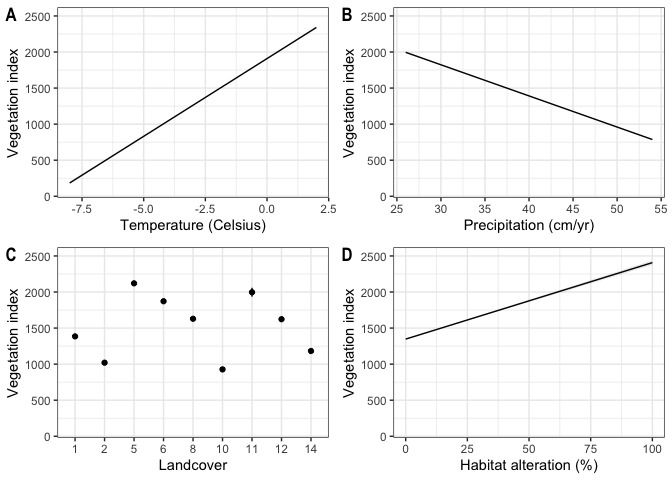

Mechanisms creating early seral productivity-spatial
================
Clayton T. Lamb
20 October, 2020

\#\#Load Data, Functions and Cleanup Data

``` r
library(raster)
library(sf)
library(mapview)
library(here)
library(velox)
library(MuMIn)
library(ggeffects)
library(ggpubr)
library(knitr)
library(gtsummary)
library(tidyverse)


##load rasters
vi <- raster(here::here("data", "dvi_annual_500m", "2010.tif"))
names(vi) <- "evi"
p <- raster(here::here("data", "climate", "precip.tif"))%>%
  projectRaster(vi)
t <- raster(here::here("data", "climate", "temp.tif"))%>%
  projectRaster(vi)

stack <- stack(vi,p,t)
plot(stack)
```

<!-- -->

``` r
##load points
pt <- st_read(here::here("data", "pointclip", "PointClip.shp"))%>%
  cbind(st_coordinates(.))%>%
  as_tibble()%>%
  dplyr::select(LinkID, X, Y)

##Load Data
pt <- read.table(here("data", "CleanProductivityData.csv"), header=TRUE, sep=",")%>%
  dplyr::select(-X, -OID_)%>%
  left_join(pt, by="LinkID")

##make spatial and convert lat/long to degrees
pt <- pt%>%
  st_as_sf(coords=c("X","Y"), crs="+proj=lcc +lat_1=49 +lat_2=77 +lat_0=49 +lon_0=-95 +x_0=0 +y_0=0 +datum=NAD83 +units=m +no_defs +ellps=GRS80 +towgs84=0,0,0")%>%
  st_transform("+proj=aea +lat_1=50 +lat_2=58.5 +lat_0=45 +lon_0=-126 +x_0=1000000 +y_0=0 +ellps=GRS80 +towgs84=0,0,0,0,0,0,0 +units=m +no_defs")%>%
  st_buffer(990)


##extract 
pt$evi <- velox(vi)$extract(sp=pt, fun=mean)[,1]
pt$precip <- velox(p)$extract(sp=pt, fun=mean)[,1]
pt$temp <- velox(t)$extract(sp=pt, fun=mean)[,1]

##to df
pt.d <-pt%>%
  cbind(st_centroid(.)%>%st_coordinates())%>%
  as_data_frame()%>%
  mutate(CanLandcover=as.factor(CanLandcover))%>%
  filter(!CanLandcover%in%c("15","16", "17", "18", "19"),##get rid of water, ice, and cities
         evi>=0) ## remove erroneous devi measures.
```

\#\#Run Models

``` r
###mods
m1 <- lm(evi~temp + precip + CanLandcover + TotalDistArea, data=pt.d)
m2 <- lm(evi~X + Y + CanLandcover + TotalDistArea, data=pt.d)


model.sel(m1,m2)%>%kable()
```

|    | (Intercept) | CanLandcover |     precip |     temp | TotalDistArea |           X |          Y | df |     logLik |    AICc |    delta | weight |
| -- | ----------: | :----------- | ---------: | -------: | ------------: | ----------: | ---------: | -: | ---------: | ------: | -------: | -----: |
| m1 |    3604.989 | \+           | \-4.317033 | 21.55911 |      265.0760 |          NA |         NA | 13 | \-953665.8 | 1907358 |    0.000 |      1 |
| m2 |    4131.136 | \+           |         NA |       NA |      203.6883 | \-0.0007933 | \-0.000922 | 13 | \-955794.5 | 1911615 | 4257.377 |      0 |

\#\#Plot Results

``` r
##PLOT
p1 <- ggplot(ggpredict(m1, terms=c("temp")), aes(x/10, predicted)) +
  geom_line() +
  geom_ribbon(aes(ymin = conf.low, ymax = conf.high), alpha = .1)+
  xlab("Temperature (Celsius)")+
  ylab("Vegetation index")+
  theme_bw()+
  ylim(100,2500)

p2 <- ggplot(ggpredict(m1, terms=c("precip")), aes(x/10, predicted)) +
  geom_line() +
  geom_ribbon(aes(ymin = conf.low, ymax = conf.high), alpha = .1)+
  xlab("Precipitation (cm/yr)")+
  ylab("Vegetation index")+
  theme_bw()+
  ylim(100,2500)

p3 <- ggplot(ggpredict(m1, terms=c("CanLandcover")), aes(as.factor(x), predicted)) +
  geom_point() +
  geom_errorbar(aes(ymin = conf.low, ymax = conf.high), width=0)+
  xlab("Landcover")+
  ylab("Vegetation index")+
  theme_bw()+
  ylim(100,2500)

p4 <- ggplot(ggpredict(m1, terms=c("TotalDistArea")), aes(x/4*100, predicted)) +
  geom_line() +
  geom_ribbon(aes(ymin = conf.low, ymax = conf.high), alpha = .1)+
  xlab("Habitat alteration (%)")+
  ylab("Vegetation index")+
  theme_bw()+
  ylim(100,2500)

ggarrange(p1,p2,p3,p4, nrow=2, ncol=2, labels="AUTO")
```

<!-- -->

``` r
ggsave("marginaleffects.png", width=5, height=5, units="in")
#ggsave("disturb.png", width=3, height=3, units="in", plot=p1)
```

\#\#Plot Tables

``` r
###standardize between 0-1 for effect size
pt.d2<- pt.d%>%
  mutate(TotalDistArea=(TotalDistArea-min(TotalDistArea, na.rm=TRUE))/(max(TotalDistArea, na.rm=TRUE)-min(TotalDistArea, na.rm=TRUE)),
         temp=(temp-min(temp, na.rm=TRUE))/(max(temp, na.rm=TRUE)-min(temp, na.rm=TRUE)),
         precip=(precip-min(precip, na.rm=TRUE))/(max(precip, na.rm=TRUE)-min(precip, na.rm=TRUE))
         )


m1s <- lm(evi~temp + precip + CanLandcover + TotalDistArea, data=pt.d2)


##table
t1 <- tbl_regression(m1)
t2 <- tbl_regression(m1s)

tbl_merge_ex1 <-
  tbl_merge(
    tbls = list(t1, t2),
    tab_spanner = c("**Original**", "**Standardized**")
  )

tbl_merge_ex1
```

<!--html_preserve-->

<style>html {
  font-family: -apple-system, BlinkMacSystemFont, 'Segoe UI', Roboto, Oxygen, Ubuntu, Cantarell, 'Helvetica Neue', 'Fira Sans', 'Droid Sans', Arial, sans-serif;
}

#ayuyumzsqg .gt_table {
  display: table;
  border-collapse: collapse;
  margin-left: auto;
  margin-right: auto;
  color: #333333;
  font-size: 16px;
  background-color: #FFFFFF;
  width: auto;
  border-top-style: solid;
  border-top-width: 2px;
  border-top-color: #A8A8A8;
  border-right-style: none;
  border-right-width: 2px;
  border-right-color: #D3D3D3;
  border-bottom-style: solid;
  border-bottom-width: 2px;
  border-bottom-color: #A8A8A8;
  border-left-style: none;
  border-left-width: 2px;
  border-left-color: #D3D3D3;
}

#ayuyumzsqg .gt_heading {
  background-color: #FFFFFF;
  text-align: center;
  border-bottom-color: #FFFFFF;
  border-left-style: none;
  border-left-width: 1px;
  border-left-color: #D3D3D3;
  border-right-style: none;
  border-right-width: 1px;
  border-right-color: #D3D3D3;
}

#ayuyumzsqg .gt_title {
  color: #333333;
  font-size: 125%;
  font-weight: initial;
  padding-top: 4px;
  padding-bottom: 4px;
  border-bottom-color: #FFFFFF;
  border-bottom-width: 0;
}

#ayuyumzsqg .gt_subtitle {
  color: #333333;
  font-size: 85%;
  font-weight: initial;
  padding-top: 0;
  padding-bottom: 4px;
  border-top-color: #FFFFFF;
  border-top-width: 0;
}

#ayuyumzsqg .gt_bottom_border {
  border-bottom-style: solid;
  border-bottom-width: 2px;
  border-bottom-color: #D3D3D3;
}

#ayuyumzsqg .gt_col_headings {
  border-top-style: solid;
  border-top-width: 2px;
  border-top-color: #D3D3D3;
  border-bottom-style: solid;
  border-bottom-width: 2px;
  border-bottom-color: #D3D3D3;
  border-left-style: none;
  border-left-width: 1px;
  border-left-color: #D3D3D3;
  border-right-style: none;
  border-right-width: 1px;
  border-right-color: #D3D3D3;
}

#ayuyumzsqg .gt_col_heading {
  color: #333333;
  background-color: #FFFFFF;
  font-size: 100%;
  font-weight: normal;
  text-transform: inherit;
  border-left-style: none;
  border-left-width: 1px;
  border-left-color: #D3D3D3;
  border-right-style: none;
  border-right-width: 1px;
  border-right-color: #D3D3D3;
  vertical-align: bottom;
  padding-top: 5px;
  padding-bottom: 6px;
  padding-left: 5px;
  padding-right: 5px;
  overflow-x: hidden;
}

#ayuyumzsqg .gt_column_spanner_outer {
  color: #333333;
  background-color: #FFFFFF;
  font-size: 100%;
  font-weight: normal;
  text-transform: inherit;
  padding-top: 0;
  padding-bottom: 0;
  padding-left: 4px;
  padding-right: 4px;
}

#ayuyumzsqg .gt_column_spanner_outer:first-child {
  padding-left: 0;
}

#ayuyumzsqg .gt_column_spanner_outer:last-child {
  padding-right: 0;
}

#ayuyumzsqg .gt_column_spanner {
  border-bottom-style: solid;
  border-bottom-width: 2px;
  border-bottom-color: #D3D3D3;
  vertical-align: bottom;
  padding-top: 5px;
  padding-bottom: 6px;
  overflow-x: hidden;
  display: inline-block;
  width: 100%;
}

#ayuyumzsqg .gt_group_heading {
  padding: 8px;
  color: #333333;
  background-color: #FFFFFF;
  font-size: 100%;
  font-weight: initial;
  text-transform: inherit;
  border-top-style: solid;
  border-top-width: 2px;
  border-top-color: #D3D3D3;
  border-bottom-style: solid;
  border-bottom-width: 2px;
  border-bottom-color: #D3D3D3;
  border-left-style: none;
  border-left-width: 1px;
  border-left-color: #D3D3D3;
  border-right-style: none;
  border-right-width: 1px;
  border-right-color: #D3D3D3;
  vertical-align: middle;
}

#ayuyumzsqg .gt_empty_group_heading {
  padding: 0.5px;
  color: #333333;
  background-color: #FFFFFF;
  font-size: 100%;
  font-weight: initial;
  border-top-style: solid;
  border-top-width: 2px;
  border-top-color: #D3D3D3;
  border-bottom-style: solid;
  border-bottom-width: 2px;
  border-bottom-color: #D3D3D3;
  vertical-align: middle;
}

#ayuyumzsqg .gt_striped {
  background-color: rgba(128, 128, 128, 0.05);
}

#ayuyumzsqg .gt_from_md > :first-child {
  margin-top: 0;
}

#ayuyumzsqg .gt_from_md > :last-child {
  margin-bottom: 0;
}

#ayuyumzsqg .gt_row {
  padding-top: 8px;
  padding-bottom: 8px;
  padding-left: 5px;
  padding-right: 5px;
  margin: 10px;
  border-top-style: solid;
  border-top-width: 1px;
  border-top-color: #D3D3D3;
  border-left-style: none;
  border-left-width: 1px;
  border-left-color: #D3D3D3;
  border-right-style: none;
  border-right-width: 1px;
  border-right-color: #D3D3D3;
  vertical-align: middle;
  overflow-x: hidden;
}

#ayuyumzsqg .gt_stub {
  color: #333333;
  background-color: #FFFFFF;
  font-size: 100%;
  font-weight: initial;
  text-transform: inherit;
  border-right-style: solid;
  border-right-width: 2px;
  border-right-color: #D3D3D3;
  padding-left: 12px;
}

#ayuyumzsqg .gt_summary_row {
  color: #333333;
  background-color: #FFFFFF;
  text-transform: inherit;
  padding-top: 8px;
  padding-bottom: 8px;
  padding-left: 5px;
  padding-right: 5px;
}

#ayuyumzsqg .gt_first_summary_row {
  padding-top: 8px;
  padding-bottom: 8px;
  padding-left: 5px;
  padding-right: 5px;
  border-top-style: solid;
  border-top-width: 2px;
  border-top-color: #D3D3D3;
}

#ayuyumzsqg .gt_grand_summary_row {
  color: #333333;
  background-color: #FFFFFF;
  text-transform: inherit;
  padding-top: 8px;
  padding-bottom: 8px;
  padding-left: 5px;
  padding-right: 5px;
}

#ayuyumzsqg .gt_first_grand_summary_row {
  padding-top: 8px;
  padding-bottom: 8px;
  padding-left: 5px;
  padding-right: 5px;
  border-top-style: double;
  border-top-width: 6px;
  border-top-color: #D3D3D3;
}

#ayuyumzsqg .gt_table_body {
  border-top-style: solid;
  border-top-width: 2px;
  border-top-color: #D3D3D3;
  border-bottom-style: solid;
  border-bottom-width: 2px;
  border-bottom-color: #D3D3D3;
}

#ayuyumzsqg .gt_footnotes {
  color: #333333;
  background-color: #FFFFFF;
  border-bottom-style: none;
  border-bottom-width: 2px;
  border-bottom-color: #D3D3D3;
  border-left-style: none;
  border-left-width: 2px;
  border-left-color: #D3D3D3;
  border-right-style: none;
  border-right-width: 2px;
  border-right-color: #D3D3D3;
}

#ayuyumzsqg .gt_footnote {
  margin: 0px;
  font-size: 90%;
  padding: 4px;
}

#ayuyumzsqg .gt_sourcenotes {
  color: #333333;
  background-color: #FFFFFF;
  border-bottom-style: none;
  border-bottom-width: 2px;
  border-bottom-color: #D3D3D3;
  border-left-style: none;
  border-left-width: 2px;
  border-left-color: #D3D3D3;
  border-right-style: none;
  border-right-width: 2px;
  border-right-color: #D3D3D3;
}

#ayuyumzsqg .gt_sourcenote {
  font-size: 90%;
  padding: 4px;
}

#ayuyumzsqg .gt_left {
  text-align: left;
}

#ayuyumzsqg .gt_center {
  text-align: center;
}

#ayuyumzsqg .gt_right {
  text-align: right;
  font-variant-numeric: tabular-nums;
}

#ayuyumzsqg .gt_font_normal {
  font-weight: normal;
}

#ayuyumzsqg .gt_font_bold {
  font-weight: bold;
}

#ayuyumzsqg .gt_font_italic {
  font-style: italic;
}

#ayuyumzsqg .gt_super {
  font-size: 65%;
}

#ayuyumzsqg .gt_footnote_marks {
  font-style: italic;
  font-size: 65%;
}
</style>

<div id="ayuyumzsqg" style="overflow-x:auto;overflow-y:auto;width:auto;height:auto;">

<table class="gt_table">

<thead class="gt_col_headings">

<tr>

<th class="gt_col_heading gt_center gt_columns_bottom_border" rowspan="2" colspan="1">

<strong>Characteristic</strong>

</th>

<th class="gt_center gt_columns_top_border gt_column_spanner_outer" rowspan="1" colspan="3">

<span class="gt_column_spanner"><strong>Original</strong></span>

</th>

<th class="gt_center gt_columns_top_border gt_column_spanner_outer" rowspan="1" colspan="3">

<span class="gt_column_spanner"><strong>Standardized</strong></span>

</th>

</tr>

<tr>

<th class="gt_col_heading gt_columns_bottom_border gt_center" rowspan="1" colspan="1">

<strong>Beta</strong>

</th>

<th class="gt_col_heading gt_columns_bottom_border gt_center" rowspan="1" colspan="1">

<strong>95% CI</strong><sup class="gt_footnote_marks">1</sup>

</th>

<th class="gt_col_heading gt_columns_bottom_border gt_center" rowspan="1" colspan="1">

<strong>p-value</strong>

</th>

<th class="gt_col_heading gt_columns_bottom_border gt_center" rowspan="1" colspan="1">

<strong>Beta</strong>

</th>

<th class="gt_col_heading gt_columns_bottom_border gt_center" rowspan="1" colspan="1">

<strong>95% CI</strong><sup class="gt_footnote_marks">1</sup>

</th>

<th class="gt_col_heading gt_columns_bottom_border gt_center" rowspan="1" colspan="1">

<strong>p-value</strong>

</th>

</tr>

</thead>

<tbody class="gt_table_body">

<tr>

<td class="gt_row gt_left">

temp

</td>

<td class="gt_row gt_center">

22

</td>

<td class="gt_row gt_center">

21, 22

</td>

<td class="gt_row gt_center">

\<0.001

</td>

<td class="gt_row gt_center">

1691

</td>

<td class="gt_row gt_center">

1669, 1713

</td>

<td class="gt_row gt_center">

\<0.001

</td>

</tr>

<tr>

<td class="gt_row gt_left">

precip

</td>

<td class="gt_row gt_center">

\-4.3

</td>

<td class="gt_row gt_center">

\-4.4, -4.2

</td>

<td class="gt_row gt_center">

\<0.001

</td>

<td class="gt_row gt_center">

\-1158

</td>

<td class="gt_row gt_center">

\-1178, -1139

</td>

<td class="gt_row gt_center">

\<0.001

</td>

</tr>

<tr>

<td class="gt_row gt_left">

CanLandcover

</td>

<td class="gt_row gt_center">

</td>

<td class="gt_row gt_center">

</td>

<td class="gt_row gt_center">

</td>

<td class="gt_row gt_center">

</td>

<td class="gt_row gt_center">

</td>

<td class="gt_row gt_center">

</td>

</tr>

<tr>

<td class="gt_row gt_left" style="text-align: left; text-indent: 10px;">

1

</td>

<td class="gt_row gt_center">

—

</td>

<td class="gt_row gt_center">

—

</td>

<td class="gt_row gt_center">

</td>

<td class="gt_row gt_center">

—

</td>

<td class="gt_row gt_center">

—

</td>

<td class="gt_row gt_center">

</td>

</tr>

<tr>

<td class="gt_row gt_left" style="text-align: left; text-indent: 10px;">

2

</td>

<td class="gt_row gt_center">

\-365

</td>

<td class="gt_row gt_center">

\-378, -351

</td>

<td class="gt_row gt_center">

\<0.001

</td>

<td class="gt_row gt_center">

\-365

</td>

<td class="gt_row gt_center">

\-378, -351

</td>

<td class="gt_row gt_center">

\<0.001

</td>

</tr>

<tr>

<td class="gt_row gt_left" style="text-align: left; text-indent: 10px;">

5

</td>

<td class="gt_row gt_center">

736

</td>

<td class="gt_row gt_center">

724, 747

</td>

<td class="gt_row gt_center">

\<0.001

</td>

<td class="gt_row gt_center">

736

</td>

<td class="gt_row gt_center">

724, 747

</td>

<td class="gt_row gt_center">

\<0.001

</td>

</tr>

<tr>

<td class="gt_row gt_left" style="text-align: left; text-indent: 10px;">

6

</td>

<td class="gt_row gt_center">

487

</td>

<td class="gt_row gt_center">

476, 498

</td>

<td class="gt_row gt_center">

\<0.001

</td>

<td class="gt_row gt_center">

487

</td>

<td class="gt_row gt_center">

476, 498

</td>

<td class="gt_row gt_center">

\<0.001

</td>

</tr>

<tr>

<td class="gt_row gt_left" style="text-align: left; text-indent: 10px;">

8

</td>

<td class="gt_row gt_center">

244

</td>

<td class="gt_row gt_center">

236, 253

</td>

<td class="gt_row gt_center">

\<0.001

</td>

<td class="gt_row gt_center">

244

</td>

<td class="gt_row gt_center">

236, 253

</td>

<td class="gt_row gt_center">

\<0.001

</td>

</tr>

<tr>

<td class="gt_row gt_left" style="text-align: left; text-indent: 10px;">

10

</td>

<td class="gt_row gt_center">

\-458

</td>

<td class="gt_row gt_center">

\-471, -444

</td>

<td class="gt_row gt_center">

\<0.001

</td>

<td class="gt_row gt_center">

\-458

</td>

<td class="gt_row gt_center">

\-471, -444

</td>

<td class="gt_row gt_center">

\<0.001

</td>

</tr>

<tr>

<td class="gt_row gt_left" style="text-align: left; text-indent: 10px;">

11

</td>

<td class="gt_row gt_center">

612

</td>

<td class="gt_row gt_center">

551, 674

</td>

<td class="gt_row gt_center">

\<0.001

</td>

<td class="gt_row gt_center">

612

</td>

<td class="gt_row gt_center">

551, 674

</td>

<td class="gt_row gt_center">

\<0.001

</td>

</tr>

<tr>

<td class="gt_row gt_left" style="text-align: left; text-indent: 10px;">

12

</td>

<td class="gt_row gt_center">

238

</td>

<td class="gt_row gt_center">

209, 267

</td>

<td class="gt_row gt_center">

\<0.001

</td>

<td class="gt_row gt_center">

238

</td>

<td class="gt_row gt_center">

209, 267

</td>

<td class="gt_row gt_center">

\<0.001

</td>

</tr>

<tr>

<td class="gt_row gt_left" style="text-align: left; text-indent: 10px;">

14

</td>

<td class="gt_row gt_center">

\-202

</td>

<td class="gt_row gt_center">

\-216, -188

</td>

<td class="gt_row gt_center">

\<0.001

</td>

<td class="gt_row gt_center">

\-202

</td>

<td class="gt_row gt_center">

\-216, -188

</td>

<td class="gt_row gt_center">

\<0.001

</td>

</tr>

<tr>

<td class="gt_row gt_left">

TotalDistArea

</td>

<td class="gt_row gt_center">

265

</td>

<td class="gt_row gt_center">

257, 273

</td>

<td class="gt_row gt_center">

\<0.001

</td>

<td class="gt_row gt_center">

1060

</td>

<td class="gt_row gt_center">

1027, 1093

</td>

<td class="gt_row gt_center">

\<0.001

</td>

</tr>

</tbody>

<tfoot>

<tr class="gt_footnotes">

<td colspan="7">

<p class="gt_footnote">

<sup class="gt_footnote_marks"> <em>1</em> </sup>

CI = Confidence Interval <br />

</p>

</td>

</tr>

</tfoot>

</table>

</div>

<!--/html_preserve-->
