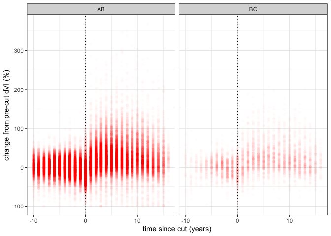
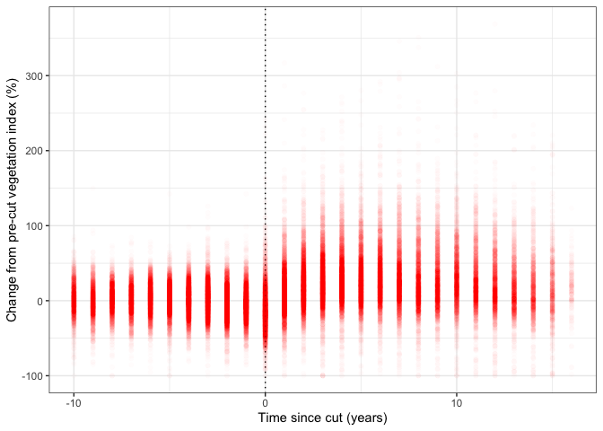

Clayton T. Lamb
06 May, 2020

Load Data, Functions and Cleanup Data
-------------------------------------

``` r
library(raster)
library(sf)
library(mapview)
library(here)
library(tidyverse)

##load cutblocks
cb<- st_read(here::here("data", "cutblocks", "cutblocks.shp"))
```

    ## Reading layer `cutblocks' from data source `/Users/clayton.lamb/Google Drive/Documents/University/Work/Serrouya_BouPathway/borealcaribou-pathanalysis/data/cutblocks/cutblocks.shp' using driver `ESRI Shapefile'
    ## Simple feature collection with 25843 features and 2 fields
    ## geometry type:  MULTIPOLYGON
    ## dimension:      XY
    ## bbox:           xmin: 1129500 ymin: 1361500 xmax: 1973681 ymax: 1702110
    ## epsg (SRID):    NA
    ## proj4string:    +proj=aea +lat_1=50 +lat_2=58.5 +lat_0=45 +lon_0=-126 +x_0=1000000 +y_0=0 +ellps=GRS80 +units=m +no_defs

``` r
##load dVI
rastlist <- list.files(path = here::here("data",  "dvi_annual_500m"), pattern='.tif', all.files=TRUE, full.names=TRUE)

order <- str_split(list.files(path = here::here("data",  "dvi_annual_500m"), pattern='.tif', all.files=TRUE),
            ".tif", simplify=TRUE)[,1]%>%
    as.numeric()

new.order <- tibble(reord=1:length(order),
       current=order)%>%
  arrange(current)
  
stack <- stack(rastlist[new.order$reord])

##load water mask
water <- raster(here::here("data", "water.tif"))

##remove water from dVI
stack<- stack*water

##fix up layers
for(i in 1:nlayers(stack)){
  values(stack[[i]])[values(stack[[i]])<0 & !is.na(values(stack[[i]]))] <- 0
}

##rename
names(stack) <- paste0("X", 2000:2019)

##plot
plot(stack)
```


filter cutblocks to years of interest, and those of appropriate size
--------------------------------------------------------------------

``` r
cb.year <-  cb%>%
  filter(HARVEST_YE %in% c(2003:2016))%>%
  mutate(area=st_area(.)%>%as.numeric())%>%
  filter(area>250000)

mean(st_area(cb.year))
```

    ## 615503.2 [m^2]

``` r
quantile(st_area(cb.year), 0.05)
```

    ## 260983.2 [m^2]

``` r
quantile(st_area(cb.year), 0.95)
```

    ## 1644879 [m^2]

Map
---

``` r
can <- st_read(here::here("data", "canada", "canada.shp"))%>%
  st_transform(st_crs(cb.year))
```

    ## Reading layer `canada' from data source `/Users/clayton.lamb/Google Drive/Documents/University/Work/Serrouya_BouPathway/borealcaribou-pathanalysis/data/canada/canada.shp' using driver `ESRI Shapefile'
    ## Simple feature collection with 13 features and 6 fields
    ## geometry type:  MULTIPOLYGON
    ## dimension:      XY
    ## bbox:           xmin: -141.0021 ymin: 41.68797 xmax: -52.61917 ymax: 83.11506
    ## epsg (SRID):    4326
    ## proj4string:    +proj=longlat +datum=WGS84 +no_defs

``` r
plot(st_geometry(cb.year),  border = 'grey', axes = TRUE)
plot(st_geometry(can), pch = 3, col = 'grey', add = TRUE)
plot(st_geometry(cb.year),  border = 'red', axes = TRUE, add = TRUE)
```


extract dVI to cublocks
-----------------------

``` r
a <- raster::extract(stack,as(cb.year,"Spatial"), fun=mean, na.rm=TRUE, method="simple",df=TRUE)
    
df <- cbind(as.data.frame(cb.year),a)%>%
  as.data.frame()%>%
  dplyr::select(-geometry)%>%
  gather(year,dvi,-HARVEST_YE,-ID,-prov)%>%
  mutate(year=str_sub(year,2,5)%>%as.numeric)%>%
  mutate(time=year-HARVEST_YE)
```

Plot
----

``` r
precut <- df%>%
  ungroup()%>%
  filter(time<=-1)%>%
  group_by(ID)%>%
  summarise(baseline=mean(dvi, na.rm=TRUE))
  
contrast <- df%>%
  left_join(precut, by="ID")%>%
  drop_na(baseline)%>%
  ungroup()%>%
  group_by(ID)%>%
  mutate(change=((dvi-baseline)/baseline)*100)%>%
  ungroup()


 contrast%>%
   group_by(time, prov)%>%
  summarise(change.sum=mean(change, na.rm=TRUE),
            se=sqrt(sd(change, na.rm=TRUE)/n()))%>%
  mutate(lower=change.sum-(se*1.96),
         upper=change.sum+(se*1.96))%>%
  filter(time>=-10 & time<17)%>%
ggplot(aes(x=time, y=change.sum))+
  geom_vline(xintercept = 0, linetype="dotted")+
  geom_point(col="red")+
  theme_bw()+
  xlab("time since cut (years)")+
  ylab("change from pre-cut dVI (%)")+
   facet_grid(.~prov)
```



``` r
 contrast%>%
   group_by(time)%>%
   summarise(change.sum=mean(change, na.rm=TRUE),
             se=sqrt(sd(change, na.rm=TRUE)/n()),
             lower=quantile(change, 0.33),
             upper=quantile(change,0.66))%>%

   filter(time>=-10 & time<18)%>%
   ggplot(aes(x=time, y=change.sum))+
   geom_vline(xintercept = 0, linetype="dotted")+
   geom_errorbar(aes(ymin = lower, ymax = upper), width=0.01, alpha=0.2)+
   geom_point(col="red")+
   theme_bw()+
   xlab("Time since cut (years)")+
   ylab("Change from pre-cut vegetation index (%)")
```



``` r
 ggsave(here::here("time_since.png"),width=6, height=4)
```
