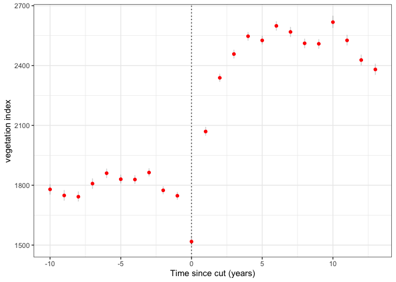
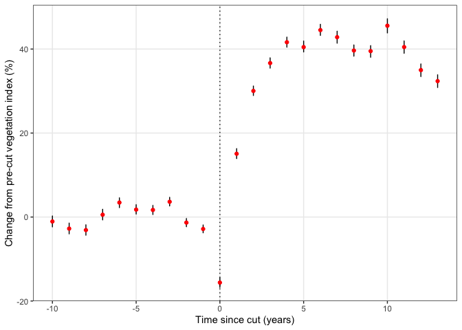

Clayton T. Lamb
20 October, 2020

\#\#Load Data, Functions and Cleanup Data

``` r
library(raster)
library(sf)
library(mapview)
library(here)
library(lme4)
library(sjPlot)
library(tidyverse)

##load cutblocks
cb<- st_read(here::here("data", "cutblocks", "cutblocks.shp"))
```

    ## Reading layer `cutblocks' from data source `/Users/clayton.lamb/Google Drive/Documents/University/Work/Serrouya_BouPathway/borealcaribou-pathanalysis/data/cutblocks/cutblocks.shp' using driver `ESRI Shapefile'
    ## Simple feature collection with 25843 features and 2 fields
    ## geometry type:  MULTIPOLYGON
    ## dimension:      XY
    ## bbox:           xmin: 1129500 ymin: 1361500 xmax: 1973681 ymax: 1702110
    ## epsg (SRID):    NA
    ## proj4string:    +proj=aea +lat_1=50 +lat_2=58.5 +lat_0=45 +lon_0=-126 +x_0=1000000 +y_0=0 +ellps=GRS80 +units=m +no_defs

``` r
##load dVI
rastlist <- list.files(path = here::here("data",  "dvi_annual_500m"), pattern='.tif', all.files=TRUE, full.names=TRUE)

order <- str_split(list.files(path = here::here("data",  "dvi_annual_500m"), pattern='.tif', all.files=TRUE),
            ".tif", simplify=TRUE)[,1]%>%
    as.numeric()

new.order <- tibble(reord=1:length(order),
       current=order)%>%
  arrange(current)
  
stack <- stack(rastlist[new.order$reord])

##load water mask
water <- raster(here::here("data", "water.tif"))%>%
  projectRaster(stack[[1]])%>%
  is.na()

values(water)[values(water)==0]<-2
values(water)<- values(water)-1
values(water)[is.na(values(water))]<-0
plot(water)
```

<!-- -->

``` r
##remove water from dVI
stack<- stack*water


##fix up layers
for(i in 1:nlayers(stack)){
  values(stack[[i]])[values(stack[[i]])<0] <- 1
  values(stack[[i]])[values(stack[[i]])==0]<-NA
}


##rename
names(stack) <- paste0("X", 2000:2020)

##plot
plot(stack)
```

<!-- -->

\#\#filter cutblocks to years of interest, and those of appropriate size

``` r
cb.year <-  cb%>%
  filter(HARVEST_YE %in% c(2003:2017))%>%
  mutate(area=st_area(.)%>%as.numeric())%>%
  filter(area>250000)

mean(st_area(cb.year))
```

    ## 619332.4 [m^2]

``` r
quantile(st_area(cb.year), 0.05)
```

    ## 260592.4 [m^2]

``` r
quantile(st_area(cb.year), 0.95)
```

    ## 1657385 [m^2]

\#\#Map

``` r
can <- st_read(here::here("data", "canada", "canada.shp"))%>%
  st_transform(st_crs(cb.year))
```

    ## Reading layer `canada' from data source `/Users/clayton.lamb/Google Drive/Documents/University/Work/Serrouya_BouPathway/borealcaribou-pathanalysis/data/canada/canada.shp' using driver `ESRI Shapefile'
    ## Simple feature collection with 13 features and 6 fields
    ## geometry type:  MULTIPOLYGON
    ## dimension:      XY
    ## bbox:           xmin: -141.0021 ymin: 41.68797 xmax: -52.61917 ymax: 83.11506
    ## epsg (SRID):    4326
    ## proj4string:    +proj=longlat +datum=WGS84 +no_defs

``` r
plot(st_geometry(cb.year),  border = 'grey', axes = TRUE)
plot(st_geometry(can), pch = 3, col = 'grey', add = TRUE)
plot(st_geometry(cb.year),  border = 'red', axes = TRUE, add = TRUE)
```

<!-- -->

\#\#extract dVI to cublocks

``` r
a <- raster::extract(stack,as(cb.year,"Spatial"), fun=mean, na.rm=TRUE, method="simple",df=TRUE)
    
df <- cbind(as.data.frame(cb.year),a)%>%
  as.data.frame()%>%
  dplyr::select(-geometry)%>%
  gather(year,dvi,-HARVEST_YE,-ID,-prov)%>%
  mutate(year=str_sub(year,2,5)%>%as.numeric)%>%
  mutate(time=year-HARVEST_YE)
```

\#\#Plot Raw Data

``` r
precut <- df%>%
  drop_na(time)%>%
  ungroup()%>%
  filter(time%in%c(-10:-1))%>%
  group_by(ID)%>%
  summarise(baseline=mean(dvi, na.rm=TRUE))
  
contrast <- df%>%
    drop_na(time)%>%
  left_join(precut, by="ID")%>%
  drop_na(baseline)%>%
  ungroup()%>%
  group_by(ID)%>%
  mutate(change=((dvi-baseline)/baseline)*100)%>%
  ungroup()


 contrast%>%
  filter(time>=-10 & time<18)%>%
ggplot(aes(x=time, y=change))+
  geom_vline(xintercept = 0, linetype="dotted")+
  geom_point(col="red", alpha=0.01)+
  theme_bw()+
  xlab("time since cut (years)")+
  ylab("change from pre-cut dVI (%)")+
   facet_grid(.~prov)
```

<!-- -->

``` r
 contrast%>%
   filter(time>=-10 & time<18)%>%
   ggplot(aes(x=time, y=change))+
   geom_vline(xintercept = 0, linetype="dotted")+
   geom_point(col="red", alpha=0.01)+
   theme_bw()+
   xlab("Time since cut (years)")+
   ylab("Change from pre-cut vegetation index (%)")
```

<!-- -->

\#\#Test for significant effect post logging

``` r
##prep data
model.data <-
  contrast%>%
  mutate(period=case_when(time<0~"Pre",
                          time>0~"Post"))%>%
  mutate(period=fct_relevel(period, "Pre", "Post"))%>%
  drop_na(period, time)

##run model with dVI values
m1 <- lmer(dvi ~ period + (1|ID), data=model.data)
summary(m1)
```

    ## Linear mixed model fit by REML ['lmerMod']
    ## Formula: dvi ~ period + (1 | ID)
    ##    Data: model.data
    ## 
    ## REML criterion at convergence: 975948.1
    ## 
    ## Scaled residuals: 
    ##     Min      1Q  Median      3Q     Max 
    ## -5.9019 -0.5688  0.0157  0.5988  6.9478 
    ## 
    ## Random effects:
    ##  Groups   Name        Variance Std.Dev.
    ##  ID       (Intercept) 244803   494.8   
    ##  Residual             253065   503.1   
    ## Number of obs: 63251, groups:  ID, 3164
    ## 
    ## Fixed effects:
    ##             Estimate Std. Error t value
    ## (Intercept) 1861.738      9.339   199.3
    ## periodPost   535.848      4.506   118.9
    ## 
    ## Correlation of Fixed Effects:
    ##            (Intr)
    ## periodPost -0.259

``` r
# ##plot model
# plot_model(m1,
#   sort.est = TRUE,
#   title = "",
# type="pred",
#   axis.title=c("deltaVI"),
# ci.lvl=0.95)

model.data%>%
  group_by(period)%>%
  summarise(mean(dvi))

##using the change
m2 <- lmer(change ~ period + (1|ID), data=model.data)
summary(m2)
```

    ## Linear mixed model fit by REML ['lmerMod']
    ## Formula: change ~ period + (1 | ID)
    ##    Data: model.data
    ## 
    ## REML criterion at convergence: 619978
    ## 
    ## Scaled residuals: 
    ##     Min      1Q  Median      3Q     Max 
    ## -6.9011 -0.5601  0.0033  0.5789  7.8571 
    ## 
    ## Random effects:
    ##  Groups   Name        Variance Std.Dev.
    ##  ID       (Intercept) 415.8    20.39   
    ##  Residual             943.7    30.72   
    ## Number of obs: 63251, groups:  ID, 3164
    ## 
    ## Fixed effects:
    ##             Estimate Std. Error t value
    ## (Intercept)   2.1393     0.4097   5.222
    ## periodPost   35.6724     0.2732 130.576
    ## 
    ## Correlation of Fixed Effects:
    ##            (Intr)
    ## periodPost -0.358

``` r
# plot_model(m2,
#   sort.est = TRUE,
#   title = "",
# type="pred",
#   axis.title=c(" % change in deltaVI"),
# ci.lvl=0.95)
```

\#\#Bootstrap results for a time-specific plot

``` r
boot.dat <- data.frame()
for(i in 1:500){
dat <-  contrast%>%
  group_by(ID)%>%
  sample_frac(1,replace = TRUE)%>%
  filter(time>=-10 & time<14)%>%
  drop_na(time,ID,dvi)

mod <- dat%>%
  lmer(dvi ~ as.character(time) + (1|ID), data=.)

dat$pred <-predict(mod)


boot.dat <- dat%>%
  group_by(time)%>%
  summarise(av=mean(dvi,na.rm=TRUE))%>%
  mutate(iter=i)%>%
  rbind(boot.dat)
}


boot.dat%>%
   group_by(time)%>%
   summarise(mean=mean(av, na.rm=TRUE),
             lower=quantile(av, 0.05),
             upper=quantile(av,0.95))%>%
   ggplot(aes(x=time, y=mean))+
   geom_vline(xintercept = 0, linetype="dotted")+
   geom_errorbar(aes(ymin = lower, ymax = upper), width=0.01, alpha=0.2)+
   geom_point(col="red")+
   theme_bw()+
   xlab("Time since cut (years)")+
   ylab("vegetation index")
```

<!-- -->

``` r
precut.boot <- boot.dat%>%
  ungroup()%>%
  filter(time%in%c(-10:-1))%>%
  group_by(iter)%>%
  summarise(baseline=mean(av, na.rm=TRUE))
  
contrast.boot <- boot.dat%>%
  ungroup()%>%
  left_join(precut.boot, by="iter")%>%
  mutate(change=((av-baseline)/baseline)*100)

  
   contrast.boot%>%
     group_by(time)%>%
   summarise(mean=mean(change, na.rm=TRUE),
             lower=quantile(change, 0.05),
             upper=quantile(change,0.95))%>%
   ggplot(aes(x=time, y=mean))+
   geom_vline(xintercept = 0, linetype="dotted")+
   geom_errorbar(aes(ymin = lower, ymax = upper), width=0.01, alpha=1, color="black")+
   geom_point(col="red")+
   theme_bw()+
   theme(panel.grid.minor = element_blank())+
   xlab("Time since cut (years)")+
   ylab("Change from pre-cut vegetation index (%)")
```

<!-- -->

``` r
    ggsave(here::here("plots", "time_since_cut_dEVI.png"),width=6, height=4)
```
